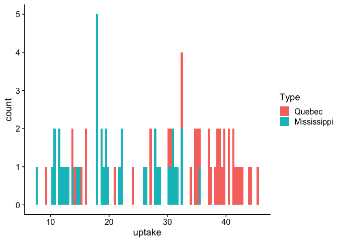
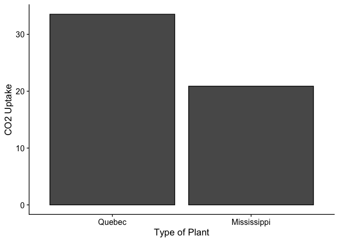
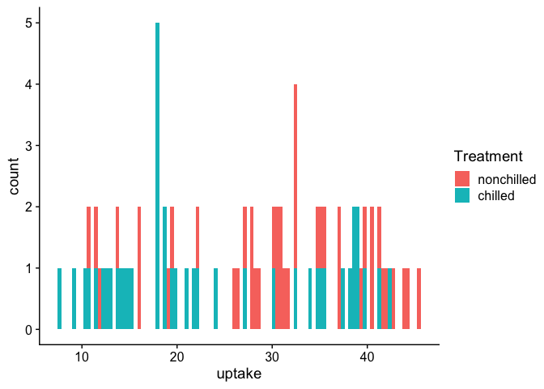
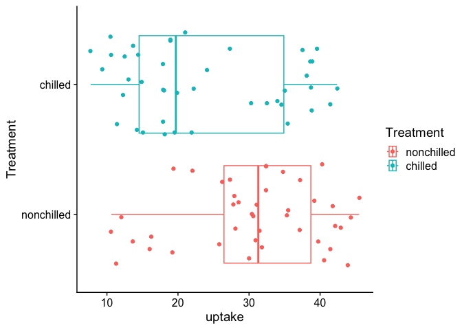
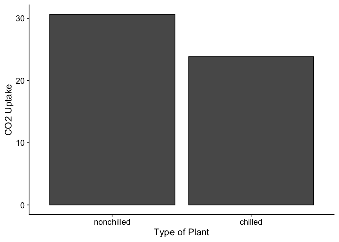

Group Project 1
================
14 Sep 2024

# Required Packages

To begin this tutorial, please load these required packages.

# Objectives

1.  By the end of this tutorial, students will be able to understand and
    confidently apply basic data analysis techniques in RStudio,
    including statistical tests ranging from summary statistics to
    ANOVAs, to interpret and analyze data sets.

1.1 Descriptive Statistics: Students will be able to calculate basic
descriptive statistics including summary statistics, such as sample
size, min, max, mean, median, and standard deviation.

1.2: Statistical Testing: Students will be able perform statistical
tests including two-sample t-test, one way ANOVA, and a two way ANOVA,
as well as understand the outputs to make informed decisions about the
data.

2.  By the end of this tutorial, students should be able to confidently
    construct different graphs, including but not limited to,
    scatterplots, bar charts, box and whisker, histograms, QQ plots,
    etc. Students will have clear interpretations of these graphs and
    how they represent relationships in the data.

2.1 Data Visualization: Students will be able to generate visualizations
of data using the ggplot function and choose the appropriate graph
according to relationships between variables, types of variables in the
dataset, and your hypothesis.

2.2 Graphical Analysis: Students will be able to effectively analyze
these graphs and have the tools to understand what the visuals mean in
terms of their hypothesis and/or question. Students will maintain
clarity in explaining what these graphs do, what our objective is in
making these graphs, and how this brings us closer to our final goal.

# Section 1.1: Descriptive Statistics

## Summary Statistics

Summary statistics are used to provide a quick summary of the data! They
are particularly useful to understand, communicate, and compare the
data.

We are going to learn how to calculate each statistic individually, and
then we will learn how to group the statistics together.

### Example

The statistics we are most interested in are min, max, mean, median, and
standard deviation. Note: The na.rm argument is a simple way of removing
missing values from data if they are coded as NA

We will begin by calculating these statistics for overall uptake.

``` r
data("CO2")
min(CO2$uptake,na.rm=TRUE)
```

    ## [1] 7.7

``` r
max(CO2$uptake,na.rm=TRUE)
```

    ## [1] 45.5

``` r
mean(CO2$uptake,na.rm=TRUE)
```

    ## [1] 27.2131

``` r
median(CO2$uptake,na.rm=TRUE)
```

    ## [1] 28.3

``` r
sd(CO2$uptake,na.rm=TRUE)
```

    ## [1] 10.81441

There is an easier way to group these statistics together that allows us
to look at the statistics for type and treatment individually! This
requires us using a function called group_by.

This is a little bit more of an advanced code, so we will walk you
through the code first! 1) summary_stats_type\<- This is where the
results of the summary statistics will be stored– you create the name.
The arrow assigns the results to the name. 2) CO2 \|\> CO2 is the
data-set we are using– we are telling R to use this data for this line
of code. The pipe operator (\|\>) is just a way to make the code easier
to read by chaining multiple operations together in a concise way.  
3) group_by(Type) This tells R to group the CO2 data by the Type column
4) summarise(count_uptake=n(), min_uptake=min(uptake),
max_uptake=max(uptake), mean_uptake=mean(uptake),
median_uptake=median(uptake), sd_uptake=sd(uptake)) We are summarizing
the different statistics into a new data frame 5)
print(summary_stats_type) This prints out summary statistics to the
screen, showing the new data frame.

We will now calculate the summary statistics grouped by type.

``` r
summary_stats_type<- CO2 |>
  group_by(Type) |>
  summarise(count_uptake=n(),
            min_uptake=min(uptake), 
            max_uptake=max(uptake),
            mean_uptake=mean(uptake),
            median_uptake=median(uptake), 
            sd_uptake=sd(uptake))
print(summary_stats_type)
```

    ## # A tibble: 2 × 7
    ##   Type    count_uptake min_uptake max_uptake mean_uptake median_uptake sd_uptake
    ##   <fct>          <int>      <dbl>      <dbl>       <dbl>         <dbl>     <dbl>
    ## 1 Quebec            42        9.3       45.5        33.5          37.2      9.67
    ## 2 Missis…           42        7.7       35.5        20.9          19.3      7.82

The mean uptake for plants from Quebec is 33.54, whereas the mean uptake
for plants from Mississippi is 20.88. These numbers seem different, but
we cannot confirm significance until we run statistical tests (Section
1.2)!

### Practice

It is now your chance to calculate the summary statistics grouped by
Treatment.

``` r
# perform summary statistics here! 
```

What is the mean uptake for chilled? What about for nonchilled? Do you
think there is a difference?

# Section 1.2: Statistical Testing

## Statistical Test: t-test

A t-test is used to test if the means of two independent variables are
significantly different.

### Example

We will begin by performing a two-sample t-test to compare CO2 uptake
between the two types of plants (Quebec and Mississippi).

The formula used is t.test(dependent variable ~ independent variable,
data= data frame) Dependent Variable: uptake Independent Variable: type

``` r
t.test(uptake~Type, data=CO2)
```

    ## 
    ##  Welch Two Sample t-test
    ## 
    ## data:  uptake by Type
    ## t = 6.5969, df = 78.533, p-value = 4.451e-09
    ## alternative hypothesis: true difference in means between group Quebec and group Mississippi is not equal to 0
    ## 95 percent confidence interval:
    ##   8.839475 16.479572
    ## sample estimates:
    ##      mean in group Quebec mean in group Mississippi 
    ##                  33.54286                  20.88333

The output shows us the p-value, which will tell us whether the
difference in means is statistically significant. If the p-value is less
than 0.05, we conclude that there is a statistically significant
difference in CO2 uptake between Quebec and Mississippi.

The p-value is 4.451e-09. We can conclude that there is a statistically
significant difference in CO2 uptake between plants from Quebec and
Mississippi.

### Practice

It is now your chance to practice performing a two-sample t-test to
compare CO2 uptake between the two treatment types (chilled and
nonchilled).

What are the dependent and independent variables? Dependent Variable:
Independent Variable:

``` r
# perform a two-sample t-test here 
```

What was the p-value?

What does this tell us about the relationship between CO2 uptake and
treatment?

## Statistical Test: one way ANOVA

A one-way analysis of variance (ANOVA) is used to determine if the means
more than 2 independent treatment groups are significantly different.

This data set only has 2 treatment groups per independent variable –
that’s okay! The results of a one-way ANOVA will be equivalent to a
two-sample t-test when analyzing 2 treatment groups.

### Example

We will begin by performing a one-way ANOVA to compare CO2 uptake
between the two types of plants (Quebec and Mississippi).

The formula used is name\<-aov(dependent variable ~ independent
variable, data= data frame) Dependent Variable: uptake Independent
Variable: type

``` r
type_anova<-aov(uptake~Type, data=CO2)
summary(type_anova)
```

    ##             Df Sum Sq Mean Sq F value   Pr(>F)    
    ## Type         1   3366    3366   43.52 3.83e-09 ***
    ## Residuals   82   6341      77                     
    ## ---
    ## Signif. codes:  0 '***' 0.001 '**' 0.01 '*' 0.05 '.' 0.1 ' ' 1

The output shows us the Pr(\>F), or the p-value, which will tell us
whether the difference in means is statistically significant. Again, if
the p-value is less than 0.05, we conclude that there is a statistically
significant difference in CO2 uptake between Quebec and Mississippi.

The p-value is 3.83e-09. We can conclude that there is a statistically
significant difference in CO2 uptake between plants from Quebec and
Mississippi.

### Practice

It is now your chance to practice performing a one way ANOVA to compare
CO2 uptake between the two treatment types (chilled and nonchilled).

What are the dependent and independent variables? Dependent Variable:
Independent Variable:

``` r
# perform one-way ANOVA here!
```

What was the p-value?

What does this tell us about the relationship between CO2 uptake and
treatment?

## Statistical Test: two way ANOVA

A two-way analysis of variance (ANOVA) is used to determine how two
independent variables, in combination, affect a dependent variable.

While this is a more advanced statistical test, there is no example,
just practice! But don’t worry, we will walk you through the code!

### Practice

The formula used is: name\<-aov(dependent variable ~ independent
variable1 \* independent variable2, data= data frame)

Based on what we have been doing, what are our dependent and independent
variables? Dependent: Independent 1: Independent 2: \*note that
independent variables 1 and 2 can be interchangeable!

``` r
# perform a two-way ANOVA here!
```

What was the p-value for treatment?

What was the p-value for type?

What was the p-value for the interaction between treatment and type?

What is a two-way ANOVA used for? What do these results tell us about
our two independent variables?

\#Section 2.1 Data Visualization

Data visualization is the graphical representation of information and/or
data. The integration of visual elements into you data analysis is
crucial for not only your understanding, but also your audience’s
understanding of patterns in the data. Data visualization also provides
easier interpretation and highlights outliers or abnormalities in the
data.

Prior to beginning our data visualization, we must form a hypothesis. Do
we think that the treatment type (chilled or non chilled conditions)
will have a significant impact on CO2 uptake? Do we think that the type
of plant (Quebec or Mississippi variant) will have a significant impact
on CO2 uptake? Here is a hypothesis we can use for this tutorial

We hypothesize that the plant variant from Quebec will have a
statistically significant difference in CO2 uptake from the Mississippi
variant and that there will be higher CO2 uptake in the Quebec variant.

Now you try! State a hypothesis about the levels of CO2 uptake dependent
on the treatment of plants.

## Graphs

### Example: Histogram

We can use a histogram to understand and determine the distribution of
the data. We are looking for a normal distribution, meaning that the
data follows a bell shaped curve. The peak of the data is where we can
find the mean value, where most individuals/datapoints can be found. A
normal distribution is symmetrical with each end of the curve tapering
off evenly. A non-normal distribution is anything that does not fall
under the description of bell shaped (ie skewed, containing multiple
peaks-“bumpy” looking, or uniform- with everything spread out evenly).

Let’s start by analyzing the CO2 uptake depending on the type of plants
(Quebec and Mississippi variants)

``` r
ggplot(CO2) +
  aes(x = uptake, fill = Type) +
  geom_histogram(bins=100) +
  theme_cowplot()
```

<!-- --> \###
Practice: Histogram Now you can try to use this code to create a
histogram comparing CO2 uptake in different treatment types (chilled and
non-chilled treatments)

Use the next few lines below to analyze the histogram. What do you
notice about the distribution? Is it normally distributed (with the
largest values on the y axis concentrated in the middle of the
histogram)? If so, this is a good sign for statistical testing and data
visualization moving forward.

Because we are comparing numerical and categorical variables, it would
be favorable to use a boxplot or a bar chart to visualize the data. If
we were comparing numerical varibles to other numerical variables, it
would be more favorable to use a scatterplot or line plot. Let’s start
off by plotting the uptake based on the type of plant using a
scatterplot.

### Example: Boxplot

Because we are comparing numerical and categorical variables, it would
be favorable to use a boxplot or a bar chart to visualize the data. If
we were comparing numerical varibles to other numerical variables, it
would be more favorable to use a scatterplot or line plot. Let’s start
off by plotting the uptake based on the type of plant using a
scatterplot.

``` r
ggplot(CO2, aes(x = uptake, y = Type, color = Type)) +
    geom_boxplot() + geom_jitter() +theme_cowplot()
```

<!-- -->
Based on this graph, it appears that the Quebec variant has a higher
mean, median, Q1 and Q3. However, we cannot deduce this just by looking
at the graph, we must complete more statistical testing.

\###Practice: Boxplot Now you can try to create a boxplot of CO2 uptake
based on treatment administered!

For the sake of the tutorial, lets create a bar chart of the same
variables in the boxplot, just to compare the two.

### Example: Bar Chart

``` r
ggplot(CO2, aes(x = Type, y=uptake), fill = Type) + geom_bar(stat = "summary", position = "dodge", color = "black")+ theme_cowplot() + scale_fill_grey()+ xlab("Type of Plant") + ylab("CO2 Uptake")
```

    ## No summary function supplied, defaulting to `mean_se()`

<!-- --> Use
the next few lines below to analyze the boxplot and bar chart.How does
this graph impact your initial view of the data and/or your hypothesis?
How does this correlate with the statistical test findings?

The bar chart yields the (seemingly) same results as the boxplot. This
time, we used the xlab and ylab codes to add specific axis labels.

### Practice: Bar Chart

Try to make a bar plot of uptake vs treatment!

We can now analyze the relationship between uptake and type of plant
using linear models. We must first convert out categorical variable
(type) to a factor so that it will be recognized in the linear model

# Section 2.2: Graphical Analysis

## Linear Models

A linear model can be used to describe and predict the relationship
between two or more variables

### Example

We can now analyze the relationship between uptake and type of plant
using linear models. We must first convert out categorical variable
(type) to a factor so that it will be recognized in the linear model

``` r
CO2$Type <- as.factor(CO2$Type)

lmType <- lm(uptake ~ Type, data = CO2)
summary(lmType)
```

    ## 
    ## Call:
    ## lm(formula = uptake ~ Type, data = CO2)
    ## 
    ## Residuals:
    ##     Min      1Q  Median      3Q     Max 
    ## -24.243  -6.243   1.187   7.027  14.617 
    ## 
    ## Coefficients:
    ##                 Estimate Std. Error t value Pr(>|t|)    
    ## (Intercept)       33.543      1.357  24.719  < 2e-16 ***
    ## TypeMississippi  -12.660      1.919  -6.597 3.83e-09 ***
    ## ---
    ## Signif. codes:  0 '***' 0.001 '**' 0.01 '*' 0.05 '.' 0.1 ' ' 1
    ## 
    ## Residual standard error: 8.794 on 82 degrees of freedom
    ## Multiple R-squared:  0.3467, Adjusted R-squared:  0.3387 
    ## F-statistic: 43.52 on 1 and 82 DF,  p-value: 3.835e-09

This linear model displays that there is a statistically significant
difference between the uptakes of the Quebec and Mississippi variants
because we observe a p-value of 3.83 x 10^-9 (lower than .05). We can
see at the estimate tab that TypeMississippi has a value of -12.660.
This means that for every unit of CO2 uptake observed in the Quebec
variant, the Mississippi variant is 12.660 units lower. Therefore, our
hypothesis regarding the value of the Quebec variant versus the
Mississippi variant is supported.

Now try this with the uptake vs treatment! Remember to convert treatment
to a factor!!

### Practice

Now try this with the uptake vs treatment! Remember to convert treatment
to a factor!!

What was your p-value?

What does your p- value say about the statistical significance of our
findings?

Was your hypothesis proven or disproven?

# Summary

Now, you should be proficient in creating summary statistics, running
statistical tests, visualizing data, and graphical analyses!

# Practice Keys

## Summary Statistic Key

``` r
summary_stats_treatment<- CO2 |>
  group_by(Treatment) |>
  summarise(count_uptake=n(),
            min_uptake=min(uptake), 
            max_uptake=max(uptake),
            mean_uptake=mean(uptake),
            median_uptake=median(uptake), 
            sd_uptake=sd(uptake))
print(summary_stats_treatment)
```

    ## # A tibble: 2 × 7
    ##   Treatment  count_uptake min_uptake max_uptake mean_uptake median_uptake
    ##   <fct>             <int>      <dbl>      <dbl>       <dbl>         <dbl>
    ## 1 nonchilled           42       10.6       45.5        30.6          31.3
    ## 2 chilled              42        7.7       42.4        23.8          19.7
    ## # ℹ 1 more variable: sd_uptake <dbl>

## T-Test Key

``` r
t.test(uptake~Treatment, data=CO2)
```

    ## 
    ##  Welch Two Sample t-test
    ## 
    ## data:  uptake by Treatment
    ## t = 3.0485, df = 80.945, p-value = 0.003107
    ## alternative hypothesis: true difference in means between group nonchilled and group chilled is not equal to 0
    ## 95 percent confidence interval:
    ##   2.382366 11.336682
    ## sample estimates:
    ## mean in group nonchilled    mean in group chilled 
    ##                 30.64286                 23.78333

## One Way ANOVA Key

``` r
treatment_anova<-aov(uptake~Treatment, data=CO2)
summary(treatment_anova)
```

    ##             Df Sum Sq Mean Sq F value Pr(>F)   
    ## Treatment    1    988   988.1   9.293 0.0031 **
    ## Residuals   82   8719   106.3                  
    ## ---
    ## Signif. codes:  0 '***' 0.001 '**' 0.01 '*' 0.05 '.' 0.1 ' ' 1

## Two Way ANOVA Key

``` r
treatment_type_anova<-aov(uptake ~ Treatment * Type, data=CO2)
summary(treatment_type_anova)
```

    ##                Df Sum Sq Mean Sq F value   Pr(>F)    
    ## Treatment       1    988     988  15.416 0.000182 ***
    ## Type            1   3366    3366  52.509 2.38e-10 ***
    ## Treatment:Type  1    226     226   3.522 0.064213 .  
    ## Residuals      80   5128      64                     
    ## ---
    ## Signif. codes:  0 '***' 0.001 '**' 0.01 '*' 0.05 '.' 0.1 ' ' 1

## Histogram Key

``` r
ggplot(CO2) +
  aes(x = uptake, fill = Treatment) +
  geom_histogram(bins=100) +
  theme_cowplot()
```

<!-- --> \##
Boxplot Key

``` r
ggplot(CO2, aes(x = uptake, y = Treatment, color = Treatment)) +
    geom_boxplot() + geom_jitter() +theme_cowplot()
```

<!-- --> \##
Bar Chart Key

``` r
ggplot(CO2, aes(x = Treatment, y=uptake), fill = Treatment) + geom_bar(stat = "summary", position = "dodge", color = "black")+ theme_cowplot() + scale_fill_grey()+ xlab("Type of Plant") + ylab("CO2 Uptake")
```

    ## No summary function supplied, defaulting to `mean_se()`

<!-- --> \##
Linear Model Key

``` r
CO2$Treatment <- as.factor(CO2$Treatment)

lmTreatment <- lm(uptake ~ Treatment, data = CO2)
summary(lmTreatment)
```

    ## 
    ## Call:
    ## lm(formula = uptake ~ Treatment, data = CO2)
    ## 
    ## Residuals:
    ##      Min       1Q   Median       3Q      Max 
    ## -20.0429  -8.6530  -0.4429   9.7321  18.6167 
    ## 
    ## Coefficients:
    ##                  Estimate Std. Error t value Pr(>|t|)    
    ## (Intercept)        30.643      1.591  19.259   <2e-16 ***
    ## Treatmentchilled   -6.860      2.250  -3.048   0.0031 ** 
    ## ---
    ## Signif. codes:  0 '***' 0.001 '**' 0.01 '*' 0.05 '.' 0.1 ' ' 1
    ## 
    ## Residual standard error: 10.31 on 82 degrees of freedom
    ## Multiple R-squared:  0.1018, Adjusted R-squared:  0.09084 
    ## F-statistic: 9.293 on 1 and 82 DF,  p-value: 0.003096
